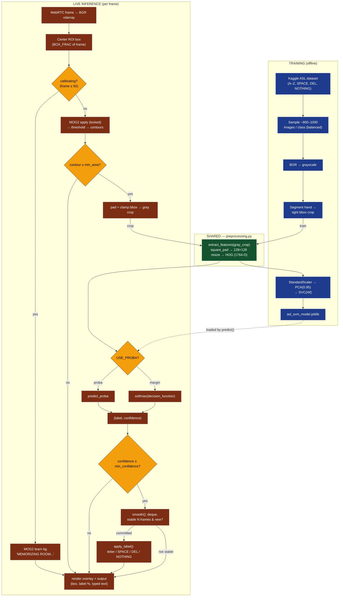

# ASL Real-Time Translator — Pipeline

Two pipelines — offline **training** and live **inference** — share one
preprocessing function (`preprocessing.extract_features`) so they can never
drift apart. GitHub renders the Mermaid diagram below automatically.

## Key points
- **Shared green node** (`preprocessing.extract_features`) is used by *both*
  training and inference — this is what guarantees the live square-pad/HOG
  matches what the model learned.
- **Confidence gate** (`F11`) drops uncertain frames before they vote.
- **Temporal smoothing** (`F12`) only commits a letter after it's stable for N frames.
- **`apply_label`** (`F13`) turns SPACE/DEL/NOTHING into real text edits, making it
  a translator rather than a per-frame classifier.
- The model currently runs the **softmax(decision_function)** branch; it switches to
  calibrated `predict_proba` automatically once retrained with `SVC(probability=True)`.

> A rendered PDF version of this diagram is in [PIPELINE.pdf](PIPELINE.pdf).
